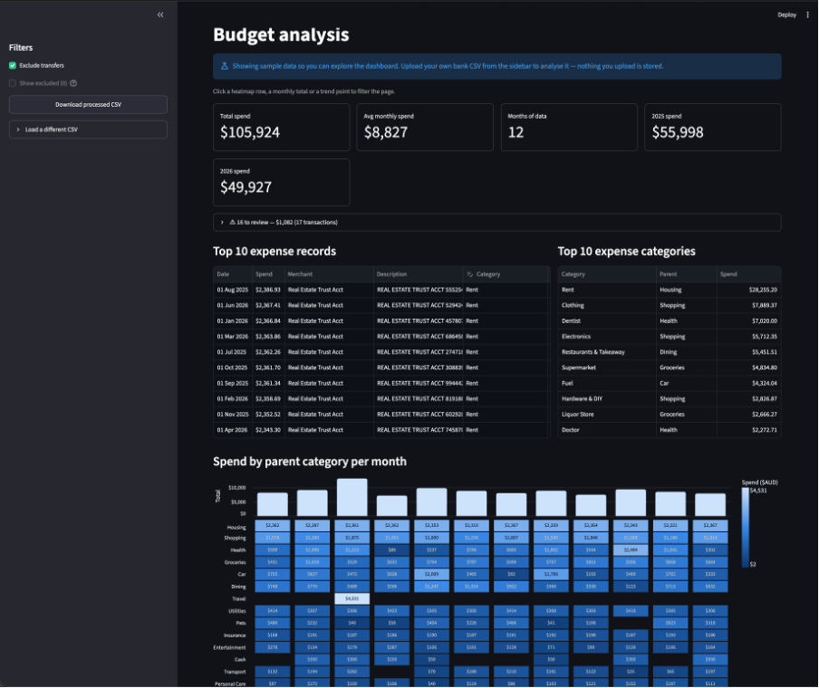

# Budget 💳

A Streamlit dashboard that turns a raw bank CSV into categorised, cross-filterable
monthly spend analysis. An LLM (Gemini) does the categorisation against a fixed
taxonomy; everything it is unsure about lands in a review queue for you to settle.

Uploaded data lives in the browser session only — it is never written to disk and
never reachable from another session.

## Screenshot



## Quick start

```sh
python -m venv .venv && source .venv/bin/activate
pip install -e .
python main.py            # or: streamlit run analyse.py
```

The app opens on committed synthetic sample data, so there is a working dashboard
to explore before you upload anything. Categorising your own raw export needs a
Gemini API key in `.env`:

```sh
GEMINI_API_KEY=...        # required only for the ingest pipeline
LOCAL_RECORDS=...         # optional: seed each session from a CSV/JSON file
```

Requires Python 3.12+ (the code uses PEP 695 generics); developed on 3.14.

## Using it

Upload from the sidebar. Two kinds of CSV are accepted, told apart by shape
(`is_processed`) rather than by asking:

- **A raw bank export** runs the ingest pipeline — one LLM call per batch of 150
  unique transactions. Progress streams onto the page.
- **A processed export downloaded from here** loads straight back in, free.

Because a refresh ends the session and its data with it, **Download processed
CSV** is the only way to keep a result without paying for a second pipeline run.

The dashboard sections are cross-filtered through one shared selection: click a
heatmap row, a monthly total or a trend point and the whole page narrows. Two
sections sit outside that on purpose — the top-10 tables are a fixed reference,
and the review queue is a to-do list a stray click must not be able to hide.

Category cells are editable anywhere they appear. An edit or an **Accept** writes
confidence 1.0, the single marker for "a person has ruled on this row", which is
what takes it out of the review queue.

## How ingest works

`ingest.run_pipeline` (see `analyse.run_ingest` for the UI side):

```
raw CSV
  -> normalise()          bank adaptor renames columns, parses dates, nan -> None
  -> parse_as_records()   Record models, ids assigned by row
  -> convert_to_dtos()    strips amount and account — the LLM never sees them
  -> get_similarity()     groups alike transactions
  -> categorise_records() one LLM call per batch, against TAXONOMY
  -> merge()              category, parent and confidence back onto every Record
```

Two things are worth knowing about:

**Grouping.** Bank descriptions are noisy (`V8213 30/06 BWS LIQUOR CAULFIELD
10379219561`), so alike transactions are grouped on their stripped description
words — or on an identical merchant where the two already agree on a category.
Only one representative per group goes to the LLM, and the answer lands on the
whole group. The same grouping collapses the review queue, so three near-identical
dinners are one decision rather than three. The thresholds and the reasoning
behind their values are documented at the top of `ingest.py`.

**Nothing is discarded.** A weak or missing classification is kept and flagged,
never dropped — throwing it away would silently understate spend. `Uncategorised`
counts towards totals like any other category; `Excluded` is the manual-only
escape hatch that keeps a transaction out of every total.

## Layout

| File | Role |
| --- | --- |
| `main.py` | Launcher — `python main.py` starts the dashboard |
| `analyse.py` | The Streamlit app: session data, selection model, all sections |
| `ingest.py` | The categorisation pipeline |
| `config.py` | `TAXONOMY`, bank adaptors, confidence threshold |
| `models.py` | `Record` plus the DTOs that cross the LLM boundary |
| `gemini.py` | Gemini call with a Pydantic JSON schema response |
| `in_out.py` | Read/write records as JSON |
| `assets/generate_synthetic.py` | Regenerates the committed sample data |
| `.streamlit/config.toml` | Theme (green primary, per light/dark mode) |

## Adding a bank

Add an entry to `BANK_ADAPTORS` in `config.py` mapping that bank's CSV headers to
`Record` field names, plus its `date_format`. Currently NAB only.

## Changing the taxonomy

`TAXONOMY` in `config.py` is the LLM's option list, and each record stores its
`parent` denormalised. After moving a category under a different parent, run
`ingest.reparent_records(path)` over any saved records file to bring it back in
line — nothing else backfills it.

## Notes

- Anything user-supplied must stay out of `@st.cache_data` — that cache is keyed
  on arguments and shared process-wide, so it would hand one viewer's
  transactions to the next.
- `assets/synthetic_expenses.csv` is marked `-text` in `.gitattributes` to keep
  its CRLF line endings, mimicking real transactions.
